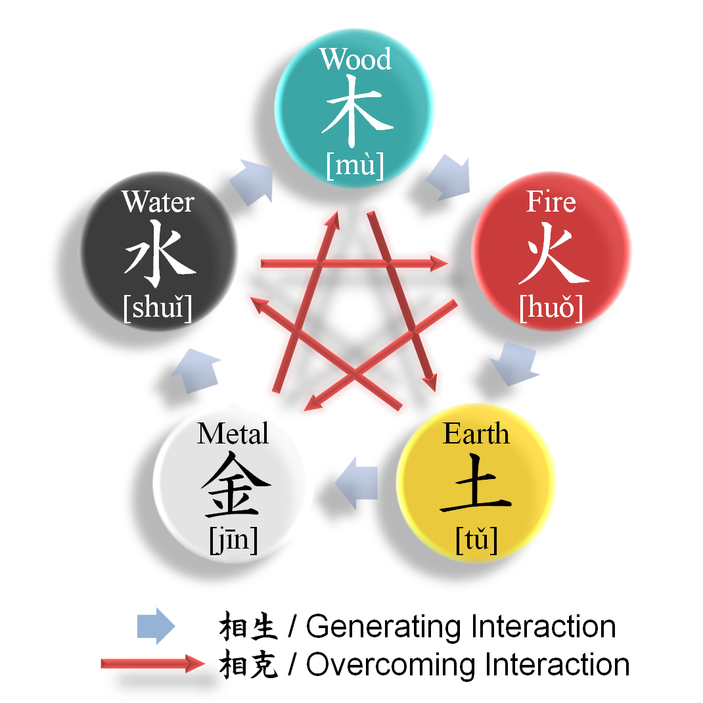
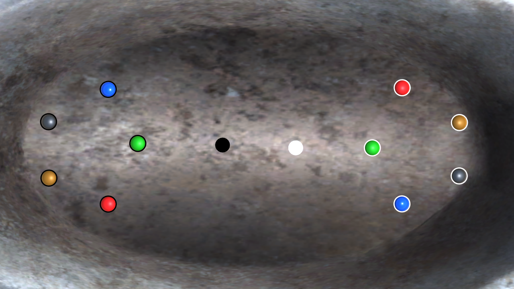
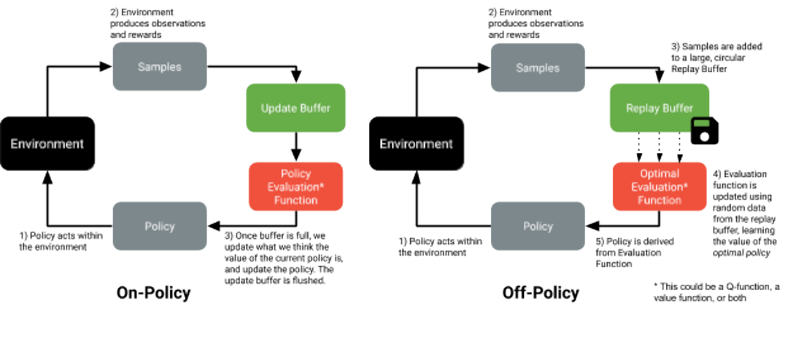
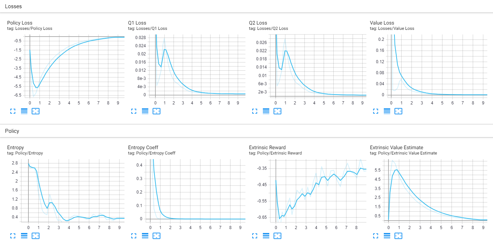
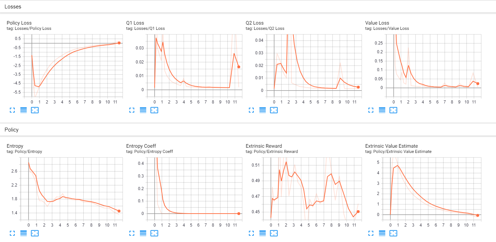

## If you'd rather get straight to business: [Play the Game from your Web Browser](https://rjstange.github.io/Orbs-of-Wuxing/)

# Orbs of Wuxing

## A Game Prototype to Demonstrate The Power of Deep Reinforcement Learning for Video Game Development using:

<h1>ML-Agents

### Premise

The concept of this game is inspired by the ancient Chinese philosophy of Wuxing, where there are five elements, each of which feeds into or destroys another. I thought it would create an interesting challenge for neural network agents to solve, as it is basically a more complex, real-time version of rock-paper-scissors. Since the game also comprises of two teams, each with 6 agents (one potentially controlled by a human), it provides a good opportunity to also demonstrate the effectiveness of self-play training methods, where a team of agents faces off against a copy of themselves, either from the present or the past.

### Rules of the Game
    

There are two teams: Yin and Yang
Each team has one cylinder-shaped object that is controlled by either a player or an AI, each with 5 AI-controlled spheres, one of each element type as described below.

Each sphere will cause one of two effects to occur with an object it collides with: 
**Absorb**: deals moderate damage (40% of the impact),  while also growing (from the remaining energy of the impact) in size, mass and speed. If an orb more than doubles in size, it will immediately lose 1/4 of it's size, mass and speed, and give it to the orb that is capable of absorbing it. If the orb capable of absorbing it is dead, it will be revived  
**Destroy**: deals high damage (105% of the impact) while taking minor damage itself (5% of the impact).

**Fire** 
Absorbs Wood 
Destroys Metal 

**Earth** 
Absorbs Fire 
Destroys Water 

**Metal** 
Absorbs Earth 
Destroys Wood 

**Water** 
Absorbs Metal 
Destroys Fire 

**Wood** 
Absorbs Water 
Destroys Earth 

**How to Win** 
To win, at least one of your spheres has to be unchallenged by spheres on the other team. An example condition of victory is as follows: 

*Your wood orb is larger than the opponent’s wood orb, and there is no longer an enemy metal or fire orb to threaten its existence, and so it is left unchallenged to eliminate the enemy earth and water orbs.*

### Agent Observations

Before the agents can make decisions, they must have observations, and so I needed to think of what would be needed for them to perform desirable behavior:

* For Orb Agents
    * They must be aware of how far away all the other orbs are, and what direction they are from them
    * They must be aware of the size of certain orbs, relative to their own
* For Player Agents
    * They must be aware of how far away all orbs are, and their enemy player counterpart, and their direction
    * They must be aware of how far away the orbs are from each other.
    * They must be aware of the size of all orbs.

### Simple overview of Neural Network Structure
    
In the last three weeks, I have been monitoring my agents training in the learning environment I have designed, as well as making tweaks to the reward function after observing less than desireable behavior. There are a lot of other hyperparameters to tune, but the details of how they work are quite in-depth, and are covered extensively in ML-Agents documentation. There are a lot more hyperparameters than listed here, but I will list what I changed from the default settings.

#### All Agents
* Learning Rate: 9e-4
* Nodes per Layer: 512
* Train Interval: 5
* Max Steps: 3e5

Note about "Train Interval", "Max Steps" and "Learning Rate": 
 "Learning Rate", which is similar to step size in gradient descent, has a recommended range between 1e-5 and 1e-3, and I ended up going with 9e-4, since I found my agents were not exhibiting desirable behavior at higher learning rates, as if they were overshooting the solution, and they weren't learning enough at lower learning rates. 
 "Train Interval" is how many steps between each agent training event, since the agent makes a decision every 5 steps by default (and anything more becomes very computationally intensive, without noticable benefit based on my experiments), the agent will make a decision, and then learn from the previous every 5 steps. A step is calculated every 0.02 seconds, so a training event and decision is made every 0.1 seconds, coming in at 10 decisions per second.  
 As for "Max Steps", I decided upon 3e5, due to that being the point when Policy Loss (the agent's willingness to explore new actions to discover how it can maximize its reward) gets the closest to zero, meaning the seemingly best solution to the environment has been found.

#### Orb Agents
* Number of Observations: 34
* Number of Dense Layers: 3
    
#### Player Agents
* Number of Observations: 80
* Number of Dense Layers: 6
    
My thought on giving the Player Agents twice as many layers as the Orb Agents is simply common sense that they will have more than twice as many observation inputs, and this seems to have created the best result thus far. Of course, improvements can be made and found with research, and expert consultation.

### Defining The Reward Function

Since the neural nets from the orbs and player agents will be trained using reinforcement learning, a system of rewards and penalties must be in place for the agent to optimize their policy, in order to exhibit desirable behavior in the environment. The rewards must never exceed the range of -1 to 1 to prevent instability in training. Since I am also utilizing self-play, the biggest rewards and penalties must come right before the end of an episode, when an agent either wins or loses. In order to motivate agents to survive and not behave recklessly, only agents that survive at the end of the episode receive a reward of 1, while all agents on the losing team receive a penalty of -1. There are also smaller rewards and penalties for the following actions: 

**Rewards** 
* To The Orb and Player Agent
  * +0.3 For killing an enemy orb
  * +0.1 for:
    * Dealing damage to an enemy orb:
      * Absorption
      * Destruction
  * +0.075 for dealing damage to a smaller orb of the same type, as a lesser absorb action
 * +0.05 for the Player Agent and both Orbs involved, with the larger orb allowing its smaller teammate to absorb it

**Penalties** 
* To the Orb and Player Agent
  * -0.3 upon killing a teammate
  * -0.1 for:
    * Taking damage from an enemy or teammate:
      * Absorption
      * Destruction
  * -0.075 for taking damage from a larger orb of the same type, as a lesser absorb action
 * -0.05 for the Player Agent only when a larger enemy orb allows its smaller teammate to absorb it

### Choice of Soft Actor-Critic as Training Method

ML-Agents provides two choices of training algorithms, Proximal Policy Optimization (on the left) and Soft Actor-Critic. Both algorithms involve the agent making a decision in the environment, which then returns observations of the agent's actions, and the rewards of those actions, which are collected together as samples. This is where the two algorithms differ, however.

PPO, on the left, takes the samples to feed into the policy evaluation function, which then, when full, determines how to update the weights of the network.

SAC, instead, takes the samples and fills up a larger replay buffer, in which the optimal evaluation function randomly draws data from to determine what the optimal policy should be, which is what the policy becomes for the next cycle.

The main advantage SAC has over PPO is that it trains much faster, approximately 5x faster, as there are samples stored in the replay buffer for the optimal evaluation function to dwell upon so that it remembers what the optimal policy is. This is why I have chosen SAC over PPO.

### Model Validation
    
Normally, in reinforcement learning, you would validate your model by observing if the mean cumulative reward goes up over time. In the case of my agents, involved in self-play, this is a metric that stays within a local minima, since both the winning and losing team's reward will be factored into the mean reward that is submitted to the Tensorboard. In this situation, using ELO as a metric is desirable, but I was unable to get that metric to display in my Tensorboard, and was unable to find a solution in a timely manner. And so, my next best option was to check in periodically to observe my agents in the middle of training to see if they are behaving in at least a somewhat desirable manner. Here are a couple of shots of the Tensorboards for the Agents used currently.

#### Orb Agents

#### Player Agents

### Current State of the Project

This is my first game project, and I am excited to have made use of my knowledge of working with deep learning to make it a focal point of the gameplay experience. The neural network powered orbs create an unpredictable gameplay element that provides an interesting and unique challenge to the player, even if the neural network controlled opponent still has a long way to go. Further experimentation and collaboration with the ML-Agents team and other reinforcement learning researchers will certainly help to yield greater results.

### Future Development Roadmap

* Get Tensorboard working properly to display the ELO training metric, so I have a better idea of my model improving over time, as the cumulative reward metric will endlessly oscillate in a self-play training scenario.

* Try to implement Raycast observations to allow for different types of gameplay (more orbs and more than two players).

* Continue to do research to get the player agents performing at a human level, and then see if they will improve from there.

* Add the capability for at least two human players to play against each other over the internet.

### Summary

Ultimately, the goal of this project is to show how reinforcement learning can be implemented into a video game developer's workflow as an alternative or supplementation to conventional AI that has been implicitly programmed in games from the beginning of the industry. The environment that I created presents a very dynamic challenge which presents the agent with choices that they have to make in order to maximize their reward. Simpler environments where the agent's goal is to draw near to the player and deal damage is far easier to accomplish, yet is very practical, and even the very animation of the agent can be done with neural networks, which would work well especially for strange monsters, where unusual looking movement is actually desired, as neural networks can come up with those solutions for the most efficient form of movement. Overall, this field of research will yield new kinds of gameplay experiences, and even increase productivity in a time-intensive development process.

## And again, here's the link to [Play the Game from your Web Browser](https://rjstange.github.io/Orbs-of-Wuxing/)
